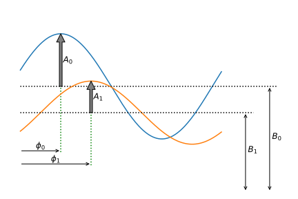

# How the reduction works
In grating interferometry a grating is stepwise translated perpendicular to the grating lines. 
This produces a sinusoidal intensity oscillation for each pixel. The intensity variations can be described by 
=B+A\sin\left(2\pi\frac{M}{N}i-\phi\right)+w(x,y,i)\quad{}i=0,1,\ldots,N)
where _M_ is the number of periods.

## The nGI equations
The reduced images are computed using estimates of _A_, _B_, and  from sample and reference images
- Transmission images: 
- Differential phase images: 
- Dark field images: 
