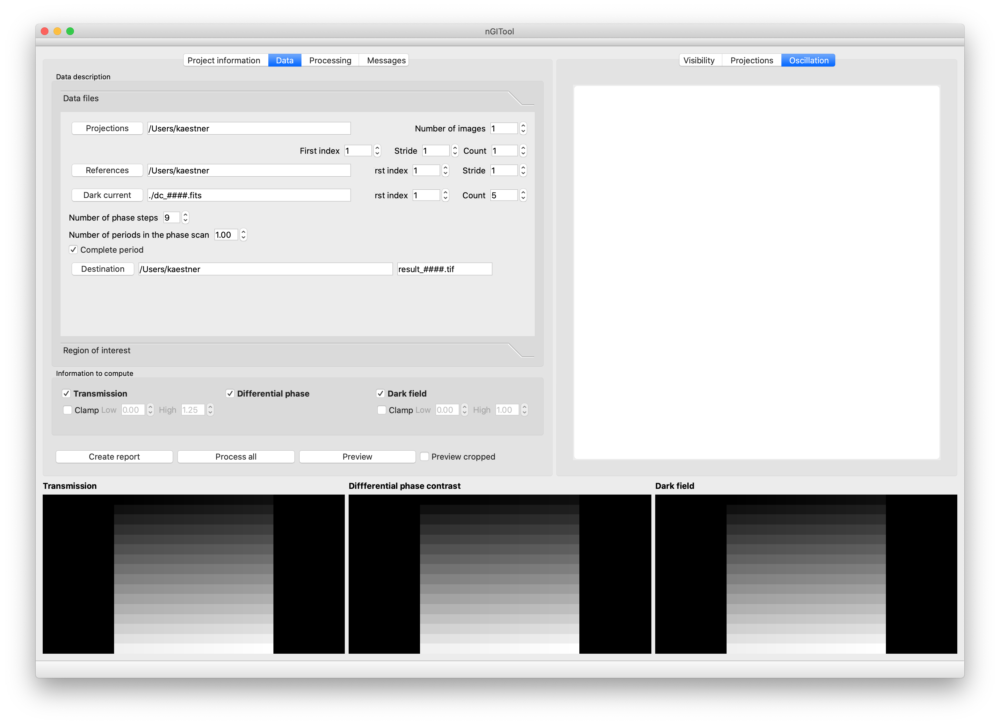

# nGITool overview

## Main screen
On the main screen you can select the file masks for sample scan, reference scan, and dark current images. The file masks are given in the format of a base name an index wildcard and file extension. 
E.g. ```/home/data/sample_####.fits``` the ####'s will be replaced by zero padded file indices i.e. index '42' results in ```/home/data/sample_0042.fits```. 

A basic reduction requires you to set 
- First index 
- Number of phase steps
- Select if the scan completes the period or stops one step ahead.

.
